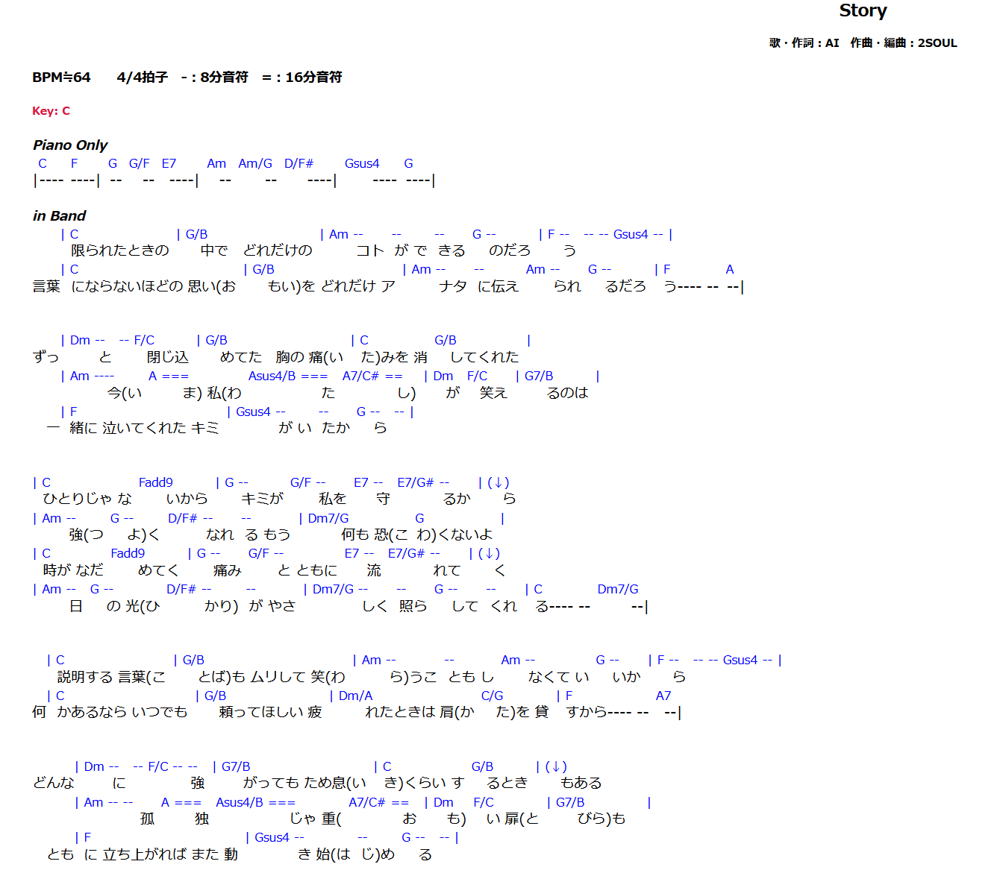
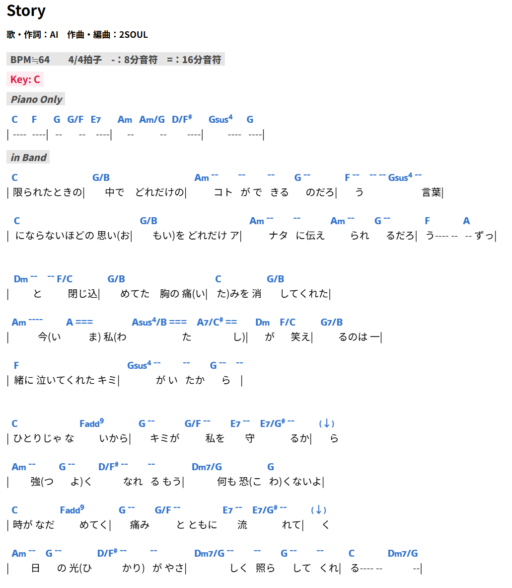

# Chordwiki-Ex（Chrome拡張）

## なにするもの？

ChordWikiの書き方が気に入らんコード譜に対して、DOMの書き換えとCSSで表示を整えるChrome拡張です。Chrome拡張としては公開する気がないです。

### DOM 処理

- 行頭に前の小節の最後の歌詞があるものを、前の行の最後に持って行きます（例：前の小節の４拍目から歌詞が始まるケース）
- コードの行に、「|（小節線扱い）」がある場合、歌詞の行に移行します。
- テンションコードが()で括られている場合、｛｝に置換します（MNoto Sans 向けの上付きテンション表示）
- コードが長い時に、歌詞の位置が右になるので、少々左に寄せます（トグルでオンオフ）
- コード行内の記号（-, =, ≫, ≧ 等）のフォントサイズ・縦位置を調整します

### 見た目（Stylebot 代替）

拡張のポップアップから **rem** 単位で調整でき、変更は**ページをリロードせず**反映されます。

- **コードの歌詞に対する縦位置**（`span.chord` の `top`）
- **譜面行の行間**（`p.line` の `padding-top`）
- **コメント行の縦位置**（`p.line.comment`）
- **空行の高さ**（譜面内の ` ` のみ）
- **コメント行**（`p.line.comment strong`）の前景色・背景色・フォントサイズ（rem）
- **キー行**（`p.key`）の前景色・背景色・フォントサイズ（rem）

Stylebot で行っていた広告非表示・譜面まわりの基本スタイルも、拡張 ON 時に適用します。

### フォント

コード表示用に [MNoto Sans (alpha)](https://github.com/ykwe/MNoto-Sans-alpha) の **v2**（`MNotoSans-alpha-ExtraBold-v2.ttf`）を同梱しています。

- ライセンス: [SIL Open Font License 1.1](https://openfontlicense.org/open-font-license-official-text)（拡張内 `fonts/OFL.txt` に全文）
- MNoto 本家: https://github.com/ykwe/MNoto-Sans-alpha

「MNoto Sansフォント対応」トグル OFF 時は `@font-face` を読み込まず、DOM の `()`→`{}` 変換も行いません。

## 例

<table>
  <tr>
    <td align="center">プレーン表示</td>
    <td align="center">適応後の表示</td>
  </tr>
  <tr>
    <td></td>
    <td></td>
  </tr>
</table>

## 使い方

1. リポジトリをクローンまたは ZIP を展開する
2. Chrome の「パッケージ化されていない拡張機能を読み込む」でこのフォルダを指定する
3. ChordWiki の曲ページを開き、ツールバーの Chordwiki-Ex アイコンから設定する

長いコード時の歌詞位置調整・MNoto 対応の切り替え時は、DOM 加工の都合で**タブのリロード**が必要です。

## その他

このツールを使った事でなんぞ不利益や不具合が発生しても、責任取りません。取れません。各自、ソースコードを調整してください。
